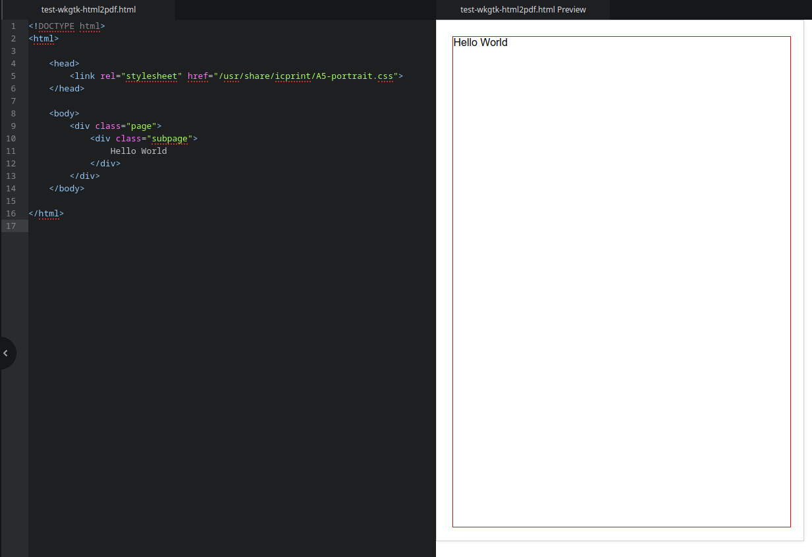

# wkgtk-html2pdf

A lightweight C++ library for generating PDFs from HTML using WebKit2GTK.

## Key Features

- **Tiny Footprint**: ~60KB binary, minimal dependencies
- **Image Support**: Base64 encodes and inlines images automatically
- **Smart CSS**: Built-in responsive layout system with visual margin guides
- **Easy to Use**: Simple C++ API with comprehensive examples
- **Automated Tag Closing**: Generate HTML directly from the API with self-closing elements
- **Easy Variable Data**: Integrate C++ data seamlessly into HTML
- **Modern Rendering Engine**: Uses WebKit2GTK for consistent, up-to-date rendering

## Why Use This?

Most HTML-to-PDF tools struggle with:
- Margins and page sizing
- Image handling
- Consistent rendering across devices

Our solution fixes these by:
1. Using CSS variables to control layout
2. Providing visual debugging with border indicators
3. Automatically handling common PDF rendering gotchas

## Installation

### Recommended: Pre-built Packages

We provide pre-built packages for Arch Linux and Debian. These include all necessary configuration files, templates, and system setup.

#### Arch Linux (AUR)
```bash
yay -S wkgtk-html2pdf
```

#### Arch Linux (Direct Download)
```bash
wget https://example.com/wkgtk-html2pdf-1.0.0-1-x86_64.pkg.tar.zst
sudo pacman -U wkgtk-html2pdf-1.0.0-1-x86_64.pkg.tar.zst
```

#### Debian/Ubuntu (Direct Download)
```bash
wget https://example.com/wkgtk-html2pdf_1.0.0_amd64.deb
sudo dpkg -i wkgtk-html2pdf_1.0.0_amd64.deb
```

> **Note**: Debian Trixie includes version 1.0.0; earlier versions may require the manual package installation above.

### Not Recommended: Building from Source

Building from source requires manual configuration of:
- CSS templates in `/usr/share/html2pdf`
- systemd `.service` file for Xvfb control
- polkit rules for passwordless service control on headless systems
- pkg-config (`.pc`) file for library discovery
- xvfb user and group creation
- User group membership setup

**We strongly recommend using the pre-built packages instead.** If you need to build from source for an unsupported platform, please open an issue on GitHub.

## Compatibility

| Distribution | Version | Status |
|--------------|---------|--------|
| Arch Linux | 1.0.0+ | ✓ Fully supported (AUR + direct download) |
| Debian Trixie | 1.0.0+ | ✓ Fully supported (direct download) |
| Debian Bookworm | 1.0.0+ | ✓ Supported (direct download) |
| Ubuntu 22.04+ | 1.0.0+ | ✓ Supported (direct download) |

## Quick Start

### Command Line Interface

For quick conversions without writing code:

```bash
html2pdf -i infile.html -o outfile.pdf -O portrait -s A4
```

### C++ API

```cpp
#include <wkgtkprinter++/ichtmltopdf++.h>
#include <wkgtkprinter++/pretty_html.h>

int main() {
    icGTK::init();
    WEBPAGE html("<!DOCTYPE html>");
    html_tree dom("html", html);
    html_tree *head = dom->new_node("head");
    head->new_node("link", "rel=\"stylesheet\" href=\"/usr/share/html2pdf/A4-portrait.css\"");
    
    html_tree *body = dom.new_node("body");
    html_tree *page = body->new_node("div", "class=\"page\"");
    html_tree *subpage = page->new_node("div", "class=\"subpage\"");

    subpage->new_node("h1")->set_node_content("Hello World");
    
    pretty_html::process_nodes(&dom);
    PDFprinter pdf;
    pdf.set_param(html, "/tmp/output.pdf");
    pdf.layout("A4", "portrait");
    pdf.make_pdf();
    
    return 0;
}
```

> **Note**: The PDF will be generated in the current working directory. Use an absolute path if you need output in a specific location.

## Advanced Features

### Guided Templates
Simply select a link to the template for the standard US or ISO page size that you wish to print and you have a page set up ready to design your document. (Page margins can be set in the stylesheet).

```html
<!DOCTYPE html>
<html>
    <head>
        <link rel="stylesheet" href="/usr/share/icprint/A5-portrait.css">
    </head>
    <body>
        <div class="page">
            <div class="subpage">
                Hello World
            </div>
        </div>
    </body>
</html>
```



Additional pages can be added with the declaration of more "page" and "subpage" elements.

### Output Options
- **File Output**: Write to a specific file path
- **Binary Large Objects (BLOBs)**: Output as BLOBs for integration with APIs like ImageMagick

## Support

For issues or feature requests, please open an issue on [GitHub](https://github.com/your-repo/wkgtk-html2pdf).

> **Note**: The documentation assumes you have the necessary system dependencies installed. For a complete list of dependencies, please check the package metadata or the GitHub repository.
