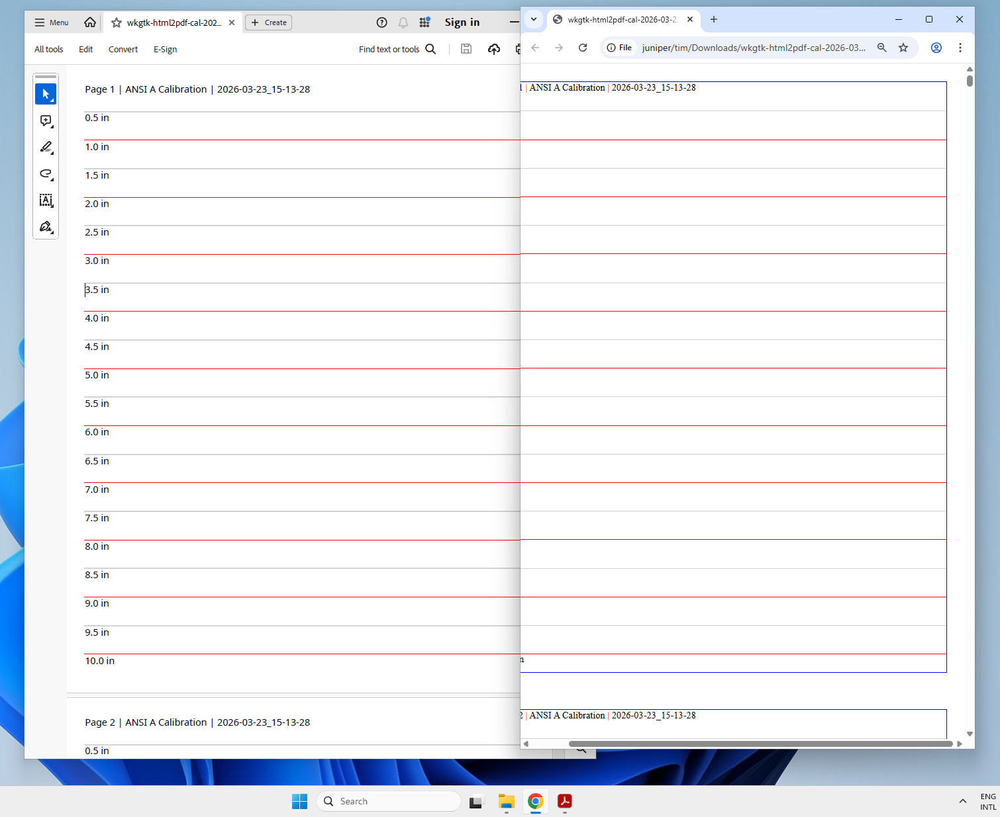
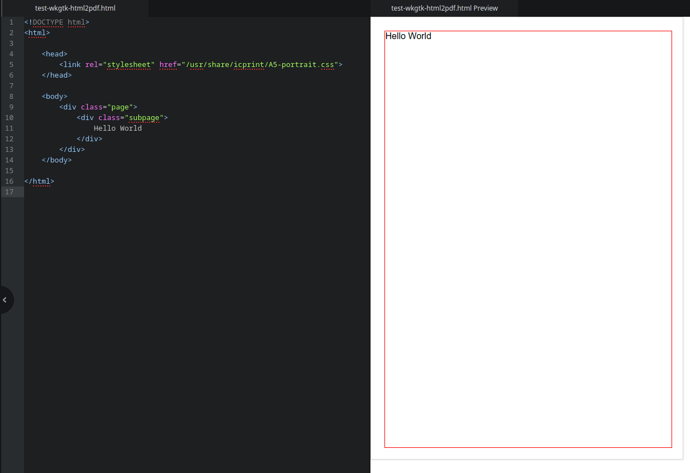

# wkgtk-html2pdf

A lightweight C++ library for generating PDFs from HTML using WebKit2GTK.

## Key Features

- **Tiny Footprint**: Small binary, minimal dependencies
- **Image Support**: Base64 encodes and inlines images automatically
- **Smart CSS**: Built-in responsive layout system with visual margin guides
- **Easy to Use**: Simple C++ API with comprehensive examples
- **Automated Tag Closing**: Generate HTML directly from the API with self-closing elements
- **Easy Variable Data**: Integrate C++ data seamlessly into HTML
- **Modern Rendering Engine**: Uses WebKit2GTK for consistent, up-to-date rendering
- **Calibration Testing**:  Built in test generator to ensure the appearance in the browswer and the resultant PDF match.



## Why Use This?

Most HTML-to-PDF tools struggle with:
- Margins and page sizing
- Image handling
- Consistent rendering across devices

Our solution fixes these by:
1. Using CSS variables to control layout
2. Providing visual debugging with border indicators
3. Automatically handling common PDF rendering gotchas

## Installation

### Recommended: Pre-built Packages

We provide pre-built packages for Arch Linux.

#### Arch Linux (AUR)
```bash
yay -Syy wkgtk-html2pdf
```

#### Arch Linux (Direct Download)
Binaries are here https://git.inplico.uk/releases/wkgtk-html2pdf/Arch/

Install example:

```bash
sudo pacman -U wkgtk-html2pdf-0.0.10-0-x86_64.pkg.tar.zst
```


### Not Recommended: Building from Source

A simple make; make install will build library and the binary and install the templates, but you will have to manage the xvfb service and group manually if you are installing on a headless system (xvfb is not necessary for systems with a desktop environment however installing without the xvfb service is untested).


## Quick Start

### Command Line Interface

For quick conversions without writing code:

```bash
html2pdf -i infile.html -o outfile.pdf -O portrait -s A4
```
For best results link to the appropriate page template; Place your content inside a **page** and **subpage** element and do not overflow the margins (See [Guided Templates](#Guided-Templates)).

### Further documentation
A full manual is provided at https://wkgtk-html2pdf.com

### C++ API

```cpp
#include <wk2gtkpdf/ichtmltopdf++.h>
#include <wk2gtkpdf/pretty_html.h>

int main() {
    icGTK::init();
    WEBPAGE html("<!DOCTYPE html>");
    html_tree dom("html", html);
    html_tree *head = dom->new_node("head");
    head->new_node("link", "rel=\"stylesheet\" href=\"/usr/share/wk2gtkpdf/A4-portrait.css\"");
    
    html_tree *body = dom.new_node("body");
    html_tree *page = body->new_node("div", "class=\"page\"");
    html_tree *subpage = page->new_node("div", "class=\"subpage\"");

    subpage->new_node("h1")->set_node_content("Hello World");
    
    pretty_html::process_nodes(&dom);
    PDFprinter pdf;
    pdf.set_param(html, "/tmp/output.pdf");
    pdf.layout("A4", "portrait");
    pdf.make_pdf();
    
    return 0;
}
```

> **Note**: The PDF will be generated in the current working directory. Use an absolute path if you need output in a specific location.

#### Building:

```make
SOURCES = $(wildcard *.cpp)
HEADERS = $(wildcard *.h)
OBJECTS = $(SOURCES:.cpp=.o)

CXX = g++
CXXFLAGS := -std=c++20 -Wall
CXXFLAGS += $(shell pkg-config --cflags webkit2gtk-4.1)

LDLIBS := -Wl,--start-group
LDLIBS += $(shell pkg-config --libs wk2gtkpdf)
LDLIBS += -Wextra -O2  -m64 -pedantic-errors -Wl,--end-group


hellopdf: $(OBJECTS)
	$(CXX) $(CPPFLAGS) $(CXXFLAGS) -o $@ $^ $(LDFLAGS) $(LDLIBS)

%.o: %.cpp
	$(CXX) $(CPPFLAGS) $(CXXFLAGS) -c $<

clean:
	rm -f $(OBJECTS) hello
```


## Advanced Features

### Guided Templates
Simply select a link to the template for the standard US or ISO page size that you wish to print and you have a page set up ready to design your document. (Page margins can be set in the stylesheet).

```html
<!DOCTYPE html>
<html>
    <head>
        <link rel="stylesheet" href="/usr/share/icprint/A5-portrait.css">
    </head>
    <body>
        <div class="page">
            <div class="subpage">
                Hello World
            </div>
        </div>
    </body>
</html>
```



Additional pages can be added with the declaration of more "page" and "subpage" elements.

### Output Options
- **File Output**: Write to a specific file path
- **Binary Large Objects (BLOBs)**: Output as BLOBs for integration with APIs like ImageMagick

## Support

For issues or feature requests, please open an issue on [GitHub](https://github.com/your-repo/wkgtk-html2pdf).

> **Note**: The documentation assumes you have the necessary system dependencies installed. For a complete list of dependencies, please check the package metadata or the GitHub repository.
